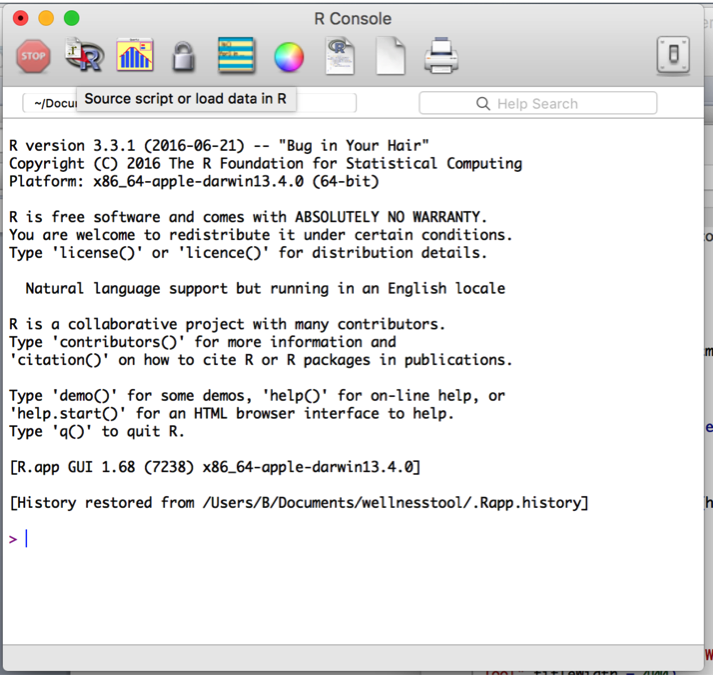
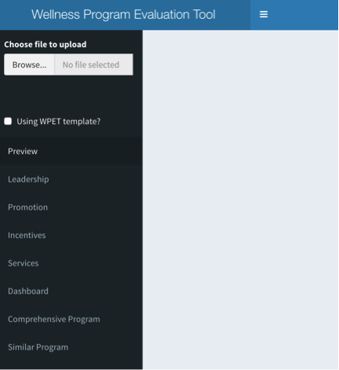
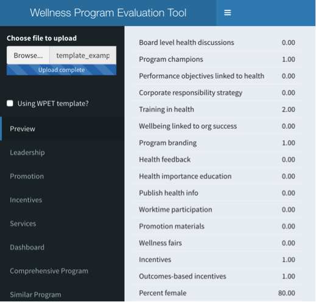

## WPET User Guide

_Installing WPET_

To use WPET, you will need to install the R statistical package (the program that runs the application) and Wthe application scripts.

You can download R from this website: [https://www.r-project.org/](https://www.r-project.org/)

The WPET script repository is here: [https://github.com/bpben/wellness](https://github.com/bpben/wellness)

To install the scripts, you will need to click on &quot;Clone or Download&quot; and then &quot;Download Zip&quot;.  You will then be able to unzip the archive to the location of your choice.

_Formatting your data_

To prepare your data for use in the tool, you can either use the template (in the data directory of the downloaded WPET scripts) or create an excel file that has your program data.  If you choose not to use the template, it may still be useful to refer to the template for proper formatting of your data.  The excel file should have one column with the names of each item and a second column with the values.

For example, if you have a company with 1,000 employees that provides smoking cessation programs, has leadership buy-in and provides email newsletters, your excel file should look something like this:

| Number of employees | 1000 |
| --- | --- |
| Smoking cessation program | 1 |
| Leadership buy-in | 1 |
| Email newsletters | 1 |

Here &quot;1&quot; indicates that the program has each of the three elements, but you could also use &quot;yes&quot;.  If there are particular elements your program does not have that you&#39;d like to display in the dashboard, add that element and put either &quot;0&quot; or &quot;no&quot;.

If you use the template, refer to the instructions included in the file.  It should look similar to the example above, but the elements are pre-defined.

_Running the tool_

The WPET runs locally on your computer.  To start it, go into the directory with the WPET scripts and double-click on global.R.  R will open and you will be presented with a terminal, which looks like this:

Type in install.packages(&quot;shiny&quot;)

This will install the shiny package for R, which is necessary to run the application.

Once it&#39;s installed type: library(&quot;shiny&quot;)

This will load the package.

One it&#39;s loaded, type: runApp()

The WPET application will now open.

_Uploading_

Upon opening the application, you will see a screen like this:

Browse to the location of the completed template or custom excel file and click &quot;open&quot;.  Also, indicate whether the file uses the WPET template.  A preview of your data will appear in the panel to the right.  Here is an example:

_Customizing the four components_

**If you used the WPET template, skip this section.**

Each of the tabs at the top of the tool correspond to the four components of a &quot;comprehensive&quot; wellness program described in the white paper (i.e. Services, Leadership, Promotion and Incentives).  Clicking on one of the tabs, for example: Leadership, will bring up a list of all the variables in your data and a brief description of what the Leadership component means.  See the screenshot below:

You can click on one or many of the variables to indicate which correspond to the Leadership component.  In this example, the values &quot;Board level health discussions&quot; and &quot;Program champions&quot; are checked.  All variables that are checked will show up in your dashboard.

_Employee information_

This tab corresponds to various employee information that will be included in visuals produced by the tool.  If you used the template as-is, variables will already be selected.  Make sure to check that these are the correct variables.  For example, if &quot;Participation percent&quot; is chosen under &quot;Employee age&quot;, you will either receive and error or misrepresented results

_Your Dashboard_

Displayed on the dashboard will be all the information you selected in the previous tabs or entered into the template.  Under the Leadership, Promotion and Incentives headings are indicators for whether a component is (green rectangle) or is not included (gray rectangle).   Under services, a star chart will be displayed showing differently-colored wedges for each of the services included.  Employee age and salary distribution will be displayed as horizontal bar charts.  Text fields display participation percent and female percent.

If any of these components are missing, go back to the tab that corresponds to the section and check that the correct values are selected.

_Comprehensive program dashboard_

This tab will display the information of the program that won the [Britain&#39;s Healthiest Company contest in 2014](https://www.healthiestworkplace.co.uk/2014-winners.html)   This program, according to the contest&#39;s standards, can be considered an example of a &quot;comprehensive program&quot;.  If you used the template, it should be easy to compare your program to this comprehensive program.  If not, it may provide some features worth implementing in your program as you aim to increase comprehensiveness.

_Similar program dashboard_

Recognizing that companies vary by sector and, within sector, by demographics and size, the tool will also display the dashboard of a program from a company with similar characteristics to yours.  In the &quot;Similar&quot; tab, you will find this dashboard, so that you are able to compare your program to one operated by a company similar to yours.  Again, the similar company&#39;s information comes from the template, so if you used the template you will be more easily able to make comparisons.  If not, this may give you an idea what other, similar companies, are offering that you may want to add to your program.